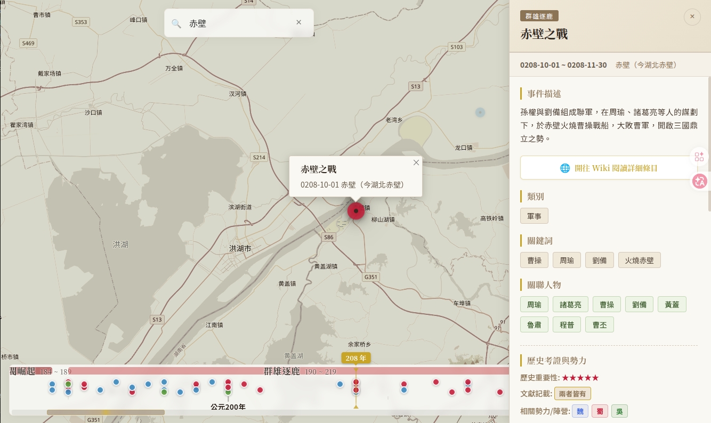
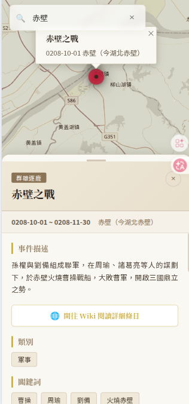

# 三國地圖 (Three Kingdoms Map)

> **「滾滾長江東逝水，浪花淘盡英雄。是非成敗轉頭空。青山依舊在，幾度夕陽紅。」**

專為三國歷史愛好者設計的互動式時空地圖。本專案將歷史時間軸與地理空間深度結合，以流暢優雅的現代 Web 介面，直觀呈獻東漢末年至三國統一期間（公元 184 年 - 280 年）的重要戰役、政治事件與人物軌跡。

🔗 **線上即時體驗**：[https://raybird.github.io/three-kingdoms-map/](https://raybird.github.io/three-kingdoms-map/)

### 截圖展示

| 桌面版 | 行動版 |
|--------|--------|
|  |  |

---

## 核心功能特色

- 🗺️ **聚焦式歷史地圖**  
  基於 Leaflet 地圖引擎，內建精心調校的邊界限制（`maxBounds`）與物理回彈黏性，防止地圖拖移出中國與東亞核心區域，並限制最小縮放級別（`minZoom: 4`），給予使用者最聚焦的歷史地理視野。
  
- ⏳ **優化版時序雙軌時間軸**  
  - **動態指針**：中央醒目的金黃色指針對齊頂部設有即時年份標籤與指標，隨滑動即時呈現精確年份。
  - **無障礙易讀性**：放大了朝代標籤（黃巾起義、群雄逐鹿、三國鼎立等）與刻度年份字體，並改用深色不透明文字與亮白 Glow (發光) 描邊陰影，即便在多采多姿的朝代色塊與背景下亦清晰好讀。
  
- 🔍 **模糊搜尋與智能檢索**  
  整合搜尋引擎，支援關鍵字即時模糊搜尋，讓您快速定位歷史人物（如關羽、曹操）與戰事地標。
  
- 📜 **富媒體歷史事件側邊欄**  
  點擊地圖上的戰役標記或時間軸事件，側邊欄會平滑滑出，詳盡展示事件背景、朝代分期與行政區劃。

- 🏷️ **關聯人物與文獻考證**  
  每個事件皆關聯了當時的歷史人物（如劉備、曹操、諸葛亮、關羽等），並以古典淡雅的竹葉綠人物標籤（Figure Tag）呈現在側邊欄中。專案更細緻標註事件文獻來源為「正史」、「演義」或「兩者皆有」，兼顧歷史嚴謹度與民間演義樂趣，並提供維基百科（Wikipedia）深度閱讀超連結。

---

## 技術架構

| 層面 | 技術 | 說明 |
|------|------|------|
| **前端框架** | Angular 20 | 提供響應式、模組化且高性能的單頁應用（SPA）架構 |
| **狀態管理** | NgRx Store 20 | 基於 Redux 模式管理歷史事件與時間軸狀態，確保數據流單向且一致 |
| **地圖引擎** | Leaflet | 輕量且靈活的開源互動地圖庫，搭配自定義圖層與座標限制 |
| **搜尋引擎** | Fuse.js | 提供零依賴的用戶端輕量級模糊搜尋能力 |

---

## 資料涵蓋與資料庫規格

- **時間跨度**：東漢末年黃巾起義（公元 184 年）起，至西晉滅吳、天下一統（公元 280 年），再延伸至八王之亂（公元 306 年）止。
- **資料規模**：正式收錄 **91 個三國史詩級歷史戰役、政治政變與文化典故事件**。
- **朝代分期**：
  - **黃巾之亂與軍閥崛起**（184年 - 220年）
  - **群雄逐鹿**（190年 - 220年）
  - **三國鼎立**（220年 - 280年）
  - **晉統一**（280年 - 306年）
- **資料庫路徑**：`public/assets/data/events.json`  
  每個事件均採用高度結構化的資料定義，便於未來開源社群共同擴展：
  ```json
  {
    "id": "three-heroes-lvbu",
    "title": "三英戰呂布",
    "description": "...",
    "date": {
      "start": "0190-03-01",
      "end": "0190-03-15",
      "period": "群雄逐鹿",
      "periodId": "turbulent-times"
    },
    "location": {
      "name": "虎牢關",
      "coordinates": [34.82, 113.20],
      "adminDivisions": ["司隸校尉部", "河南尹"]
    },
    "categories": ["軍事"],
    "keywords": ["虎牢關", "劉關張"],
    "relatedEvents": ["huaxiong-slain"],
    "sourceType": "演義",
    "factions": ["蜀"],
    "historicalSignificance": "中",
    "wikiUrl": "https://zh.wikipedia.org/wiki/...",
    "relatedFigures": ["劉備", "關羽", "張飛", "呂布", "董卓"]
  }
  ```

---

## 專案文件指引

- 🗺️ **[開發藍圖與進度 (Roadmap)](file:///home/raybird/Documents/RCodes/three-kingdoms-map/docs/roadmap.md)**：查看 Phase 1 / 2 / 3 的架構搭建與功能更新歷史。

---

## 快速開始

### 1. 複製專案與安裝依賴
```bash
git clone https://github.com/raybird/three-kingdoms-map.git
cd three-kingdoms-map/webapp
npm install
```

### 2. 啟動開發伺服器
```bash
npm start
```
啟動後在瀏覽器開啟 `http://localhost:4200` 即可進行開發與預覽。

### 3. 生產打包建置
```bash
npm run build
```

---

## 🔗 相關專案 (Related Projects)

| 專案 | 簡介 |
|------|------|
| [🗺️ cap-map](https://github.com/raybird/cap-map) | 專為臺灣國中會考社會科設計的互動式時空地圖，結合歷史時間軸與地理空間判讀，幫助學生建立立體史觀與強化地圖判讀能力。 |
| [⚔️ jymap](https://github.com/raybird/jymap) | 將金庸十五部小說的傳奇故事，交織在同一張互動地圖上，看見江湖隨朝代變遷。 |


---

*TeleNexus Studio | Raybird*